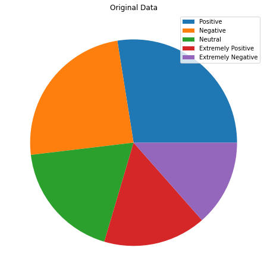
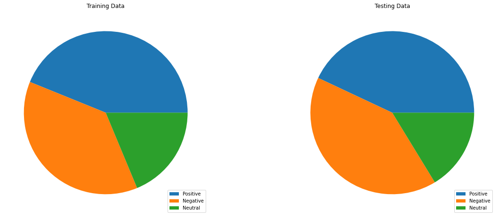
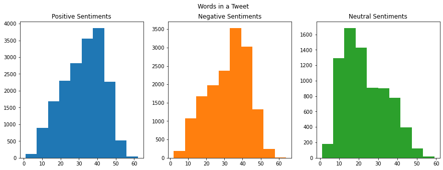
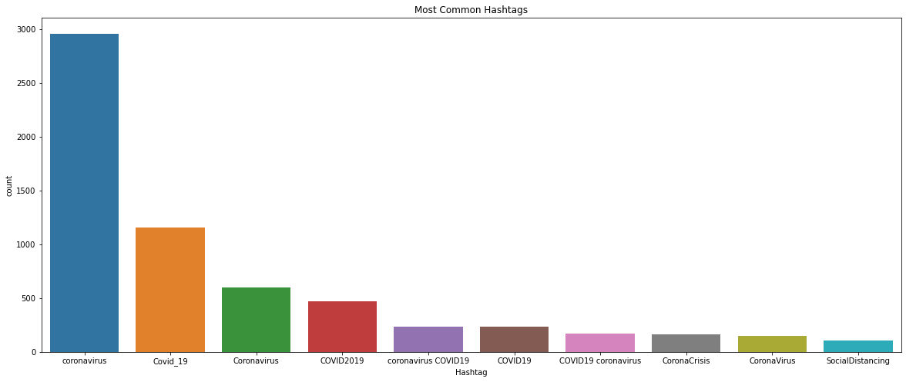
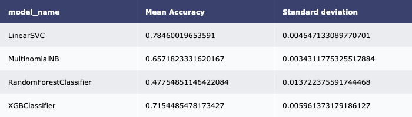
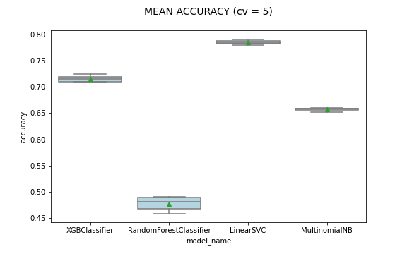
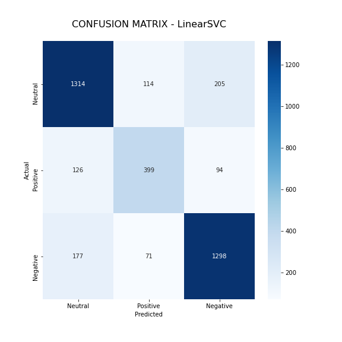

# <a title="Text Classification for Identifying Tweet Sentiment Related to COVID-19"> Text Classification for Identifying Tweet Sentiment Related to COVID-19</a>

The twitter dataset comes from [kaggle](https://www.kaggle.com/datatattle/covid-19-nlp-text-classification) and displays a large number of tweets that have been manually tagged as extremely positive, positive, neutral, negative, or extremely negative. The data contains information about location, time of the tweet, the original tweetm and the data. For this data we plan to train a machine learning model to perform text classification.

## Exploratory Analysis

The data has five category labels, but I will be shrinking extremely positive and postive into one "positive" variable, as well as, negative and extremely negative into one "negative" category. The distribution of labels is displayed is the next two figures.

##### Original Data Set

##### Combined Category Data Set

The distribution of sentiments seem to be more heavily weighted towards positive and negative tweets and less towards neutral.

### Number of Words per Tweet

The neutral tweets tend to be less lengthy than the positive and negative tweets which may be a significant factor in our classificaiton model.

### Most Common Hashtags

### Most Common Mentions

## Data Preprocessing

#### 1) Removing stopwords and capitalizations

- Stopwords contain low-level information from our text, so we remove them to give more focus to the important information. The stop words come from the nltk library in python that contain words like ‘ourselves’, ‘hers’, ‘between’, ‘yourself’, ‘but’, ‘again’, etc.

#### 2) Removing HTML links, url links, and punctuation
#### 3) Removing mentions, hashtags, and empty white space

#### Original Tweet:
    - We're here to provide a safe shopping experience for our customers and a healthy environment for our associates and community! 
    Online orders can be placed here: https://t.co/dCSXHUj3U0 #jlmco #jlmcobrand #coronapocolypse #coronavirus #CoronavirusOutbreak  #COVID19 #shoponline https://t.co/riNKwskeRS
    
#### After Changes:
    - were here to provide a safe shopping experience for our customers and a healthy environment for our associates and community online orders can be placed here jlmco jlmcobrand coronapocolypse coronavirus coronavirusoutbreak covid19 shoponline

#### 4) Vectorizing Data

I used TF IDF vectorizer which tokenizes allowig us tp encode the text varaible of the tweets.

## Models

We fit random forest, xgboost, naive bayes, and linear support vector machine models for classification. The results are as follows:

With the liner suspport vector classifier performing the best, we use it to make our predictive model.

## LSVM Classifier

| Model              | Precision         | Recall       | f1-score      | support |
| --- | --- | --- | --- | --- |
| Neutral  | 0.81   | 0.80  | 0.81 | 1633 |
| Positive | 0.68   | 0.64  | 0.66 | 619 |
| Negative | 0.81   | 0.84  | 0.83 | 1546 |
|  |  |  |  |  |
| Accuracy   |      |       | 0.79 | 3798 |
| Macro Avg  | 0.77 | 0.76  | 0.77 | 3798 |
| Weighted Avg| 0.79| 0.79  | 0.79 | 3798 |

 

