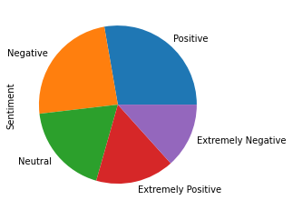

# <a title="Text Classification for Identifying Tweet Sentiment Related to COVID-19"> Text Classification for Identifying Tweet Sentiment Related to COVID-19</a>

The twitter dataset comes from [kaggle](https://www.kaggle.com/datatattle/covid-19-nlp-text-classification) and displays a large number of tweets that have been manually tagged as extremely positive, positive, neutral, negative, or extremely negative. The data contains information about location, time of the tweet, the original tweetm and the data. For this data we plan to train a machine learning model to perform text classification.

## Exploratory Analysis

The data has five category labels, but I will be shrinking extremely positive and postive into one "positive" variable, as well as, negative and extremely negative into one "negative category. The distribution of labels is displayed below.

